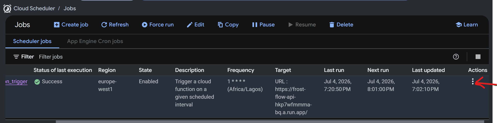
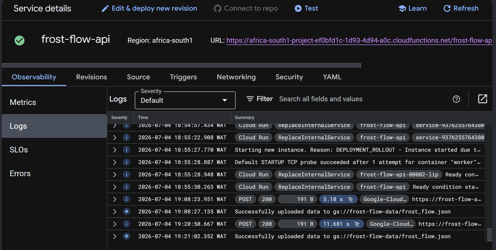

## Frost-Flow Cloud Native Analytics Platform

**FrostFlow analytics platform** is a cloud-native, terraform managed, data engineering solution, designed to automate the ingestion, storage, and analysis of data.

Using Snowflake Snowpipe and external stage feature, data is automatically ingested into the data warehouse for transformation, analysis, and reporting.

FrostFlow delivers a secure and automated analytics platform that enables business intelligence and decision-making.

<br>


## Problem Statement

Most organizations generate volumes of data from external APIs, but often struggle with efficiently ingesting, processing, and making this data analytics-ready in a timely and reliable manner.

Traditional data pipelines are typically manual, and prone to delays, making it difficult to support analytics and business decision-making. Additionally, managing infrastructure introduces complexity, scalability challenges, and operational overhead.

There is a need for a fully automated, cloud-native data pipeline that can reliably ingest external data, store it securely, and make it readily available for transformation and analysis without manual intervention.

The **FrostFlow Analytics Platform** addresses this challenge by implementing a Terraform-managed data pipeline using **Google Cloud Services and Snowflake**, enabling automated ingestion through Cloud Functions and Cloud Scheduler, secure storage in Cloud Storage, and loading into Snowflake using Snowpipe and external stage integration.


## Objectives
The main objective of the **FrostFlow Analytics Platform** is to design and implement a fully automated, cloud-native data engineering pipeline that enables seamless ingestion, storage, and analytics of data with minimal manual intervention.

This project aims to:
- Build a fully automated data ingestion pipeline using **external APIs, Google Cloud Functions, and Cloud Scheduler**.
- Implement a secure data loading mechanism using **Snowflake Snowpipe** and **external stage integration**.
- Ensure seamless data flow from cloud storage into the Snowflake data warehouse for transformation and analytics.
- Leverage **Terraform (Infrastructure as Code)** to provision and manage all cloud resources in a consistent and repeatable manner.
- Enable reliable data availability for **business intelligence, reporting, and decision-making use cases**.
 
### Tools & Services Used
| Tool / Service | Purpose |
|---|---|
| External API | Source system providing raw data for ingestion |
| Python | Extracts data from the API and processes responses |
| Google Cloud Functions | Runs serverless Python code for data extraction |
| Google Cloud Scheduler | Automates and schedules data extraction jobs |
| Google Cloud IAM | Manages authentication and access control across services |
| Google Cloud Storage | Stores raw API data in JSON format |
| Terraform | Infrastructure as Code (IaC) for provisioning cloud resources |
| Snowflake | Cloud data warehouse for storage and analytics |
| Snowpipe | Automatically ingests new data files from cloud storage into Snowflake |
| Snowflake Storage Integration | Securely connects Snowflake to Google Cloud Storage |
| Snowflake Stage | External reference to cloud storage location for loading data |
| SQL | Used for data querying, transformation, and analytics in Snowflake |

## Setup Instructions

  ## Clone the repository
  ```bash
    git clone https://github.com/ioaviator/Frost-Flow-Analytics-Platform.git
  ```

## Setup and create Google Cloud resources
  - ### Login to Google Cloud using the gcloud cli command

```bash
  gcloud auth application-default login
```

  - ### Navigate to the terraform folder. 
  - ### Copy the text inside `terraform.ex.tfvars` into the terraform.tfvars file.
  - ### Add your google cloud auth enabled email address
  
```bash
  # navigate to the terraform folder
  cd terraform

  # copy values into terraform.tfvars
  cp terraform.ex.tfvars terraform.tfvars

  # terraform.tfvars
  email="mail@mail.com"
```
  - ### Initialize terraform provider configurations

```bash
  terraform init

  terraform plan (Optional)

```

 - ### The automated pipeline is scheduled to run every 2 hours. You can change this schedule time inside terraform `main.tf` file, to run at a lesser interval.  (e.g: Every 2 minutes)
  
  ```json
    resource "google_cloud_scheduler_job" "cloud_func_trigger" {
      name             = "cloud_function_trigger"
      description      = "Trigger a cloud function on a given scheduled interval"
      region           = "europe-west1"
      schedule         = "0 */2 * * *"  # change interval here
      time_zone        = "Africa/Lagos"
      attempt_deadline = "120s"

      retry_config {
        retry_count = 1
      }

      http_target {
        http_method = "POST"
        uri         = google_cloudfunctions2_function.cloud_func_resource.service_config[0].uri
      }
    }

  ```
- ### Create the resources
```bash
  terraform apply -auto-approve
```

## Pipeline Schedule Confirmation
  - Login to Google cloud console
  - Navigate to the Cloud Scheduler service
  - Select the created Cloud Scheduler resource, click on actions, select **View logs**
  - Inspect the logs
  
  <br>
  
  

  <br>

  - Navigate to the cloud run function service
  - Select the cloud function that was created using Terraform
  - Click on Logs
  - Inspect the logs 
  
  <br>

  

## Delete all resources
```bash
  terraform destroy -auto-approve
```