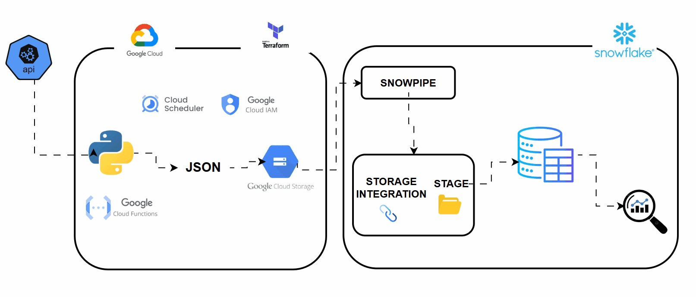

## Frost-Flow Cloud Native Analytics Platform

**FrostFlow analytics platform** is a cloud-native data engineering solution designed to automate the ingestion, storage, and analysis of data.

Using Snowflakes Snowpipe and external stage features, data is automatically ingested into the data warehouse for transformation, analysis, and reporting.

FrostFlow delivers a secure, and low-maintenance analytics platform that enables near real-time business intelligence and faster decision-making.

 

