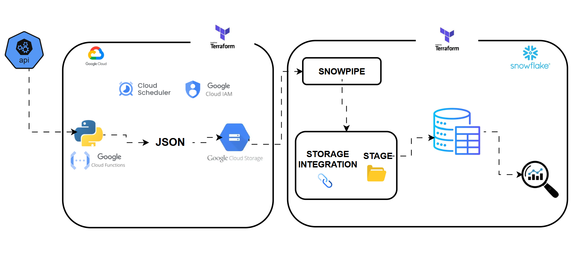
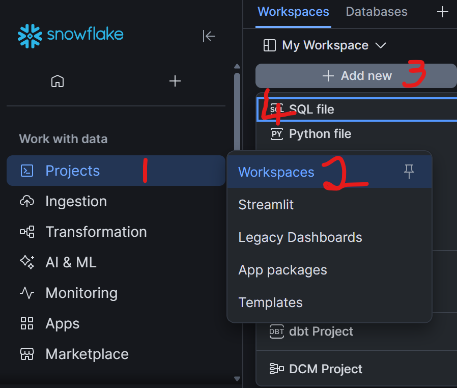
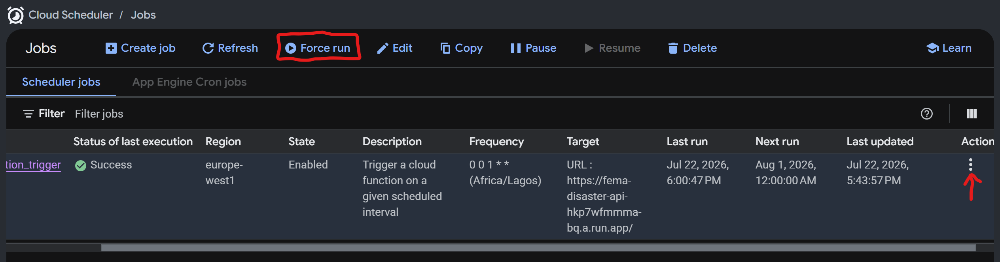
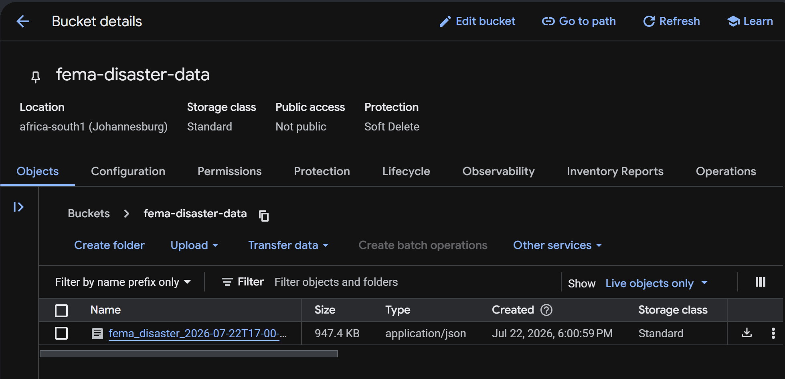
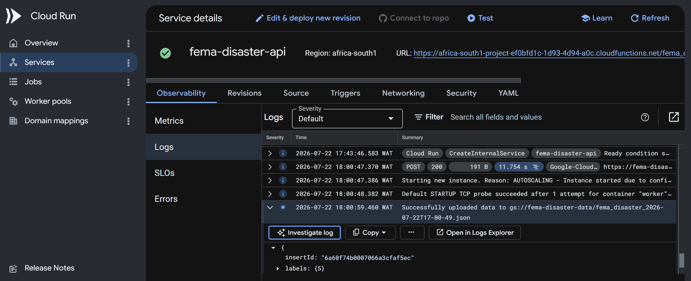
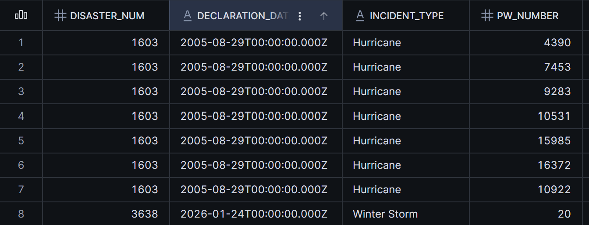

# FEMA Disaster Intervention Analytics Platform

A cloud-native data engineering solution designed to automate the ingestion, storage, transformation, and analysis of FEMA disaster intervention data.

The platform enables organizations and emergency management teams to process disaster-related information, including disaster declarations, assistance programs, affected locations, and intervention activities, to support faster response coordination and data-driven decision-making.

Using **Snowflake Snowpipe** and **external stage integration**, disaster datasets are automatically ingested from **Google Cloud Storage** into Snowflake for transformation, analytics, and reporting.

The platform provides a secure, scalable, and automated analytics foundation that enables improved disaster response planning, resource allocation, and operational visibility.

<br>




## Problem Statement

Emergency management organizations generate and consume volumes of disaster-related data. This data contains valuable information about disaster events, affected communities, assistance programs, and recovery efforts.

However, organizations often face challenges in efficiently collecting, processing, and analyzing this information due to manual ingestion processes, and limited visibility into real-time disaster intervention activities.

Traditional approaches can result in delayed reporting, inconsistent data availability, and difficulties in identifying areas requiring immediate assistance. Additionally, manually managing data infrastructure introduces operational complexity.

There is a need for a reliable and automated data platform that can continuously ingest FEMA disaster data, securely store it, transform it into analytics-ready datasets, and provide actionable insights for emergency response and recovery operations.

The **FEMA Disaster Intervention Analytics Platform** addresses this challenge by implementing a Terraform-managed cloud data pipeline using **Google Cloud Services and Snowflake**. The platform automates data ingestion through cloud-based services, stores raw datasets in Google Cloud Storage, and loads data into Snowflake using **Snowpipe and external stage integration** for downstream analytics and reporting.


## Objectives

The main objective of the **FEMA Disaster Intervention Analytics Platform** is to build a fully automated cloud-based data engineering solution that enables reliable ingestion, processing, and analysis of disaster intervention data.

This project aims to:

- Build an automated data ingestion pipeline for FEMA disaster datasets using cloud-native services.
- Ingest disaster-related data from external data sources into Google Cloud Storage for centralized storage.
- Implement a secure and scalable data loading mechanism using **Snowflake Snowpipe** and **external stage integration**.
- Design a structured data warehouse solution in Snowflake to support disaster analytics and reporting.
- Enable transformation of raw disaster data into clean, analytics-ready datasets for decision-making.
- Use **Terraform Infrastructure as Code** to provision and manage cloud resources consistently and repeatably.

## Tools & Services Used
| Tool / Service | Purpose |
|---|---|
| **External API** | Source system providing raw data for ingestion |
| **Python** | Extracts data from the API and processes responses |
| **Google Cloud Functions** | Runs serverless Python code for data extraction |
| **Google Cloud Scheduler** | Automates and schedules data extraction jobs |
| **Google Cloud IAM**| Manages authentication and access control across services |
| **Google Cloud Storage** | Stores raw API data in JSON format |
| **Terraform** | Infrastructure as Code (IaC) for provisioning cloud resources |
| **Snowflake** | Cloud data warehouse for storage and analytics |
| **Snowpipe** | Automatically ingests new data files from cloud storage into Snowflake |
| **Snowflake Storage Integration** | Securely connects Snowflake to Google Cloud Storage |
| **Snowflake Stage** | External reference to cloud storage location for loading data |
| **Snowflake Notification Integration** | Secure, authentication allowing Snowflake to exchange event messages with Google Cloud Pub/Sub
| **SQL** | Used for data querying, transformation, and analytics in Snowflake |

## Setup Instructions

  ### Clone the repository
  ```bash
    git clone https://github.com/ioaviator/Fema-Disaster-Intervention-Analytics-Platform.git
  ```

  ### Setup and create Google Cloud resources
  - Login to Google Cloud using the gcloud cli command

    ```bash
      gcloud auth application-default login
    ```

  - Navigate to the terraform folder. 
  - Copy the text from `terraform.ex.tfvars` into the terraform.tfvars file.
  - Fill-in the details in the terraform.tfvars with your required credentials
  
  ```bash
    # navigate to the terraform folder
    cd terraform

    # copy values into terraform.tfvars
    cp terraform.ex.tfvars terraform.tfvars

    # terraform.tfvars
    project_id       = "google account project id"
    email            = "email used to authenticate with google cloud"
    org_name         = "snowflake organization name"
    account_name     = "snowflake account name"
    username         = "snowflake username"
    password         = "snowflake password"
  ```
  
  - Initialize terraform provider configurations

  ```bash
    terraform init

    terraform plan (Optional)
  ```

  - The automated pipeline is scheduled to run every month. You can change this schedule time inside terraform `gcp.tf` file, to run at a lesser interval.  (e.g: Every 2 hours)
  
  ```json
    resource "google_cloud_scheduler_job" "cloud_func_trigger" {
      name             = "cloud_function_trigger"
      description      = "Trigger a cloud function on a given scheduled interval"
      region           = "europe-west1"
      schedule         = "0 0 1 * *"  # change interval here
      time_zone        = "Africa/Lagos"
      attempt_deadline = "120s"

      retry_config {
        retry_count = 1
      }

      http_target {
        http_method = "POST"
        uri         = google_cloudfunctions2_function.cloud_func_resource.service_config[0].uri
      }
    }
  ```
  
  ### Create the resources
  - This creates the required google cloud and snowflake resource
  ```bash
    terraform apply -auto-approve
  ```

  ### Snowflake Resource Confirmation
  - Login to your snowflake dashboard
  - Create a workspace 
  - Add a new SQL file to the workspace
    


  - Fetch the storage integration and notification integration service account id
  
  ```sql
    DESCRIBE STORAGE INTEGRATION fema_storage_int;

    DESC NOTIFICATION INTEGRATION fema_notification_int;
  ```

  - Navigate to the **snowflake_iam** folder inside the terraform folder. 
  - Copy the text from **terraform.ex.tfvars** into the **terraform.tfvars** file.
  - Fill-in the details in the **terraform.tfvars** with your required credentials

```bash
  # navigate to the terraform folder
  cd terraform/snowflake_iam

  # copy values into terraform.tfvars
  cp terraform.ex.tfvars terraform.tfvars

  # terraform.tfvars
  project_id               = "google account project id"
  storage_int              = "snowflake strorage integration service account id"
  notification_integration = "snowflake notification integration service account id"
  org_name                 = "snowflake organization name"
  account_name             = "snowflake account name"
  username                 = "snowflake username"
  password                 = "snowflake password"
```

  - Create the resources
    - This creates the required google cloud iam permissions and snowflake snowpipe resource
  
  ```bash
    terraform apply -auto-approve
  ```

  ### Pipeline Schedule Confirmation
  - Login to Google Cloud console
  - Navigate to the Cloud Scheduler service
  - Select the created Cloud Scheduler resource, click on actions, select **View logs**
  - Inspect the logs

  ====================================================
  - Force the Cloud Scheduler resource trigger by selecting the deployed resource and click on **Force run**  
  
  <br>

  ### Cloud Scheduler

  

  <br>

  ### Cloud Storage Bucket

  
  
  <br>

  - Navigate to the cloud run function service
  - Select the cloud function that was created using Terraform
  - Click on Logs
  - Inspect the logs 
  
  <br>

  ### Cloud Run Function

  
  
  <br>

## Snowflake Resource Confirmation
  - Wait for 3-5 minutes for snowpipe to finalize ingesting the data into snowflake
  - Login to your snowflake dashboard
  - Run the SQL query
  
  ```sql
    SELECT * FROM fema_disaster.raw.fema_intervention
  ```
## Transform the ingested data
  ```sql
  WITH recent_data AS(
    SELECT 
      payload,
      src_file,
      ingestion_time
    FROM fema_disaster.raw.fema_intervention
    WHERE src_file = (
    -- Subquery ensuring you only see records from the absolute newest file processed
      SELECT src_file 
      FROM fema_disaster.raw.fema_intervention
      ORDER BY ingestion_time DESC 
      LIMIT 1
    )
  )

-- Flatten FEMA intervention JSON payload into structured columns
  SELECT 
    fema.value:disasterNumber::INTEGER AS disaster_num,
    fema.value:declarationDate::STRING AS declaration_date,
    fema.value:incidentType::STRING AS incident_type,
    fema.value:pwNumber::INTEGER AS pw_number,
    fema.value:applicationTitle::STRING AS app_title,
    fema.value:applicantId::STRING AS applicant_id,
    fema.value:damageCategoryCode::STRING AS damage_cat_code,
    fema.value:damageCategoryDescrip::STRING AS damage_desc,
    fema.value:projectStatus::STRING AS project_status,
    fema.value:projectProcessStep::STRING AS project_process_step,
    fema.value:projectSize::STRING AS project_size,
    fema.value:county::STRING AS county,
    fema.value:countyCode::INTEGER AS county_code,
    fema.value:stateAbbreviation::STRING AS state_abbr,
    fema.value:stateNumberCode::INTEGER AS state_num_code,
    fema.value:projectAmount::DOUBLE AS project_amount,
    fema.value:federalShareObligated::DOUBLE AS fed_share_obligated,
    fema.value:totalObligated::DOUBLE AS total_obligated,
    fema.value:lastObligationDate::TIMESTAMP AS last_obligation_date,
    fema.value:firstObligationDate::TIMESTAMP AS first_obligation_date,
    fema.value:mitigationAmount::DOUBLE AS mitigation_amount,
    fema.value:gmProjectId::INTEGER AS gm_project_id,
    fema.value:gmApplicantId::INTEGER AS gm_applicant_id
  FROM 
    recent_data AS stg,
    LATERAL FLATTEN(input => stg.payload) fema
  ```
  ### Verify the SQL output

  

  - Write your SQL queries to explore and analyze the data

## Delete all resources
```bash
  cd terraform/snowflake_iam
  terraform destroy -auto-approve

  cd terraform
  terraform destroy -auto-approve

```